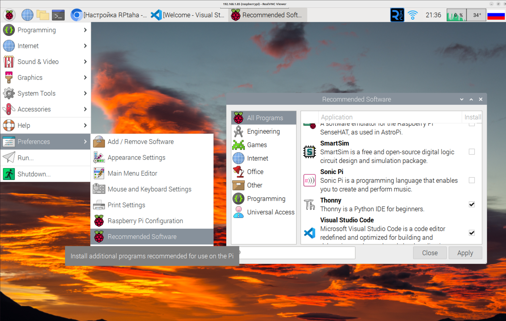

# Настройка RPtaha

## Установка образа на Raspberry Pi4

1. Скачай образ операционной системы [RP4 Bullseye](https://ln5.sync.com/dl/4083226a0/e7t6w7jp-x4vqthff-8v9fxzuh-9y84f2x4/view/default/12603243340004)**.** Более подробная информация о образе системы доступна на [github компании Q-engineering](https://github.com/Qengineering/RPi-Bullseye-DNN-image). Если ссылка для скачивания образа будет не доступна, то скачай его с [Яндекс Диска](https://disk.yandex.ru/d/jI3tcIIIQy1Wuw).
2. Установи [balenaEtcher](https://balena-etcher.com/) и запиши с её помощью образ полученный в первом пункте на микро SD-карту. Помни, что объем памяти карты должен быть не менее 16 Gb. 
3. Вставь микро SD-карту в Raspberry Pi4.  Подожди несколько минут, пока образ распакуется до полного размера SD-карты.
4. Обнови системные пакеты до крайних версий. 
    
    ### Важно!
    
    - Имя пользователя: pi
    - Пароль: 3.14
    
    Имя пользователя и пароль не требуются для входа в систему, но нужны для подключения с помощью VNC. Поэтому их лучше запомнить. 
    
    ### Советы:
    
    - По умолчанию Raspberry Pi разогнан до 1850 МГц. Дополнительную информацию смотри в разделе [разгон Raspberry Pi](https://qengineering.eu/overclocking-the-raspberry-pi-4.html).
    - Если нужно дополнительное место на SD-карте, то можно удалить папки opencv и opencv и opencv_contrib. В них больше нет необходимости, поскольку все библиотеки размещены в каталоге /usr/local.
    - Установи VScode с помощью утилиты Recommended Software
        
        
        
    - Как добавить еще одну раскладку клавиатуры показано ниже
        
        
        

